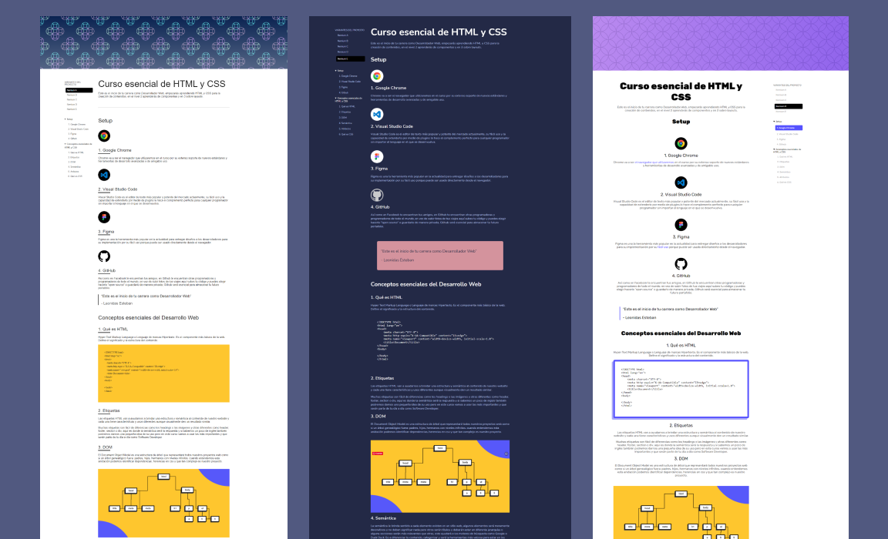
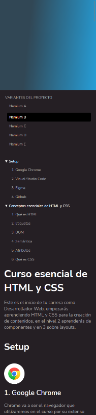

# Curso Esencial de HTML y CSS

Este proyecto es parte del **Curso Esencial de HTML y CSS** de 
 [leonidasesteban.com](https://leonidasesteban.com/aprender/html-css-fundamentos)

Este proyecto contiene 5 vistas, las cuales se usaron propiedades fisicas y logicas, que son temas del curso🙂 .

1. Nemium A
2. Nemium B
3. Nemium C
4. Nemium D
5. Nemium E

### Demo :computer:

Has click en el enlace para ver el  **[resultado](https://cesarchoqueskater.github.io/curso-esencial-html-css/)** 

### Imagenes :camera:

